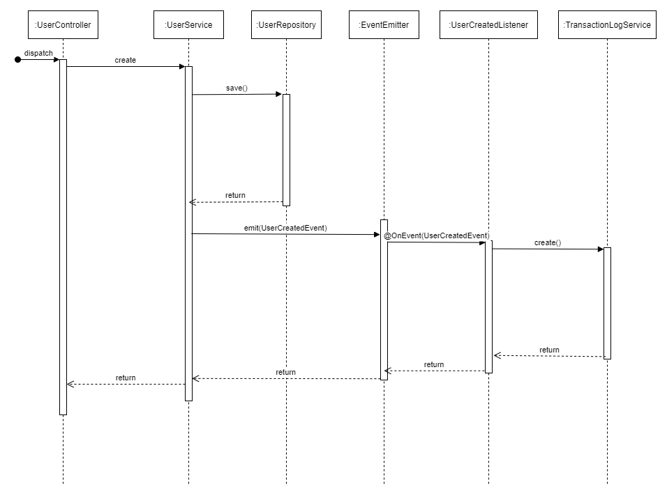

# Handling Audit Events in Adopt A Highway

## OVERVIEW

Adopt A Highway has an audit requirement. Changes to records for certain actions need to be recorded in a table containing the user who made the change, a string of the Action taken,  the table and record in which it was changed, and finally a comment. The actions will be on CRUD actions for tables such as the USER_PERSON, AGREEMENT, etc. Future epics, will rely on this method to record audit events

# SAVING CHANGES AND RECORDING THE AUDIT

Auditing records means that we have to log a record to a table of any event we wish to audit. One simplistic approach would be to add the Audit Log table to every service and simply make two save actions.

But this means that our service layer has two responsibilities. One is to perform actions on its entity, and to perform an action on another audit entity. There is a way to avoid this needless complexity.

Although we are not using a CQRS architecture, we can still dispatch audit events on the service layer using an Event Emitter. Event Emitter provides a consistent approach to recording our CRUD actions without introducing more complexity into our Service layer.

Below is a sequence diagram for the `UserCreatedEvent`. UserCreatedEvent will create an audit event log to record when a new user is created.

An End user starts the process by dispatching a POST request to the `/User` route containing a `CreateUserDto` of all required properties. Immediately, this action is handled by the `UserService` which saves the new user using the UserRepository - actually, `Repository<User>`. The repository returns the user, from which the ID of the newly created `USER_PERSON`record is used in the next step.
Upon the return, the Event Emitter is called with the `UserCreatedEvent`. There is an `EventsEnum` enumeration containing all string events to be handled by the EventEmitter. We pass a `UserCreatedEvent` dto containing the information that is needed to record the audit - acting username, the ID of the `USER_PERSON` record that was just saved.

The Event Emitter emits this event object to be picked up by the event listener that handles this event - `UserCreatedListener`. The sole purpose of `UserCreatedListener` is to log the event in the log table using the DTO that was passed.

The `UserCreatedEvent` is completely de-coupled from the application. The event emitter locates this class by the `EventsEnum` defined in the decorator - `@OnEvent(EventsEnum.UserCreatedEvent)`.

Audit records need the following pieces of information:

* `USERNAME` of the authenticated user who dispatched the action
* `DATE` timestamp of the action - now
* `TABLENAME` is an enumeration of the AAH table name
* `TABLE_ID` is the ID of the resulting record for the action
* `ACTION` an enumeration of CRUD activities - CREATE, UPDATE, DELETE
* `DESCRIPTION` holds comments about the action; we will describe the specific action with a generic comment.

The `UserCreatedListener` already knows the `DATE`, `TABLENAME`, `ACTION`, and `DESCRIPTION` properties. The `UserCreatedEvent` will supply the `USERNAME` and `TABLE_ID`. The audit log record is created.

This action successfully concludes after the user record has been created, and the audit record has been logged.

# FOLDER STRUCTURE

Within each entity folder, we create the events listeners folders. If a DTO is required for entity CRUD operations, create a dto folder as well. For creating the new `User`, we had to create a `CreateUserDto` that the `UserController` could validate and use. For our current purposes to add audit functionality as an example, we only needed to add the base functionality. DTO Validation was not performed as this User activity will likely be converted to an action that creates an Internal User that includes a `Role`.

## CONCLUSION

Adopt A Highway's Audit Requirement can be resolved easily in our service layer using `EventEmitter` and events. Future audit requirements will require a new event enumeration string, event and listener classes.  The new user created provides a simplistic implementation of this pattern.
